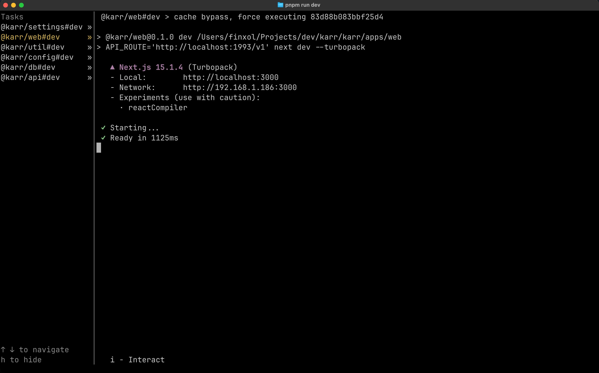

import { Icon } from '@astrojs/starlight/components';

Karr is a monorepo, meaning it contains multiple packages.

To make it easier and more efficient to manage, we make use of
[Turborepo](https://turbo.build/repo/docs).
This enables parallel builds and caching.

## Existing packages

Each package is defined by its `package.json`.

The root package is `karr`.
It doesn't contain any actual application logic, it's there purely to scaffold and organise the project.

The `apps/` directory contains all the application packages, so what is meant to be shipped and used by clients.
It contains:

- `web`: The Nextjs web frontend
- `api`: The Hono API
- `caddy`: The Caddy reverse proxy to put the pieces together.
- `auth`: An auth package that may or may not disappear in the future

The `packages/` directory contains all packages that are rather meant to be imported elsewhere in the monorepo.
They aren't meant to be distributed or accessed as standalone.
It contains:

- `config`: Imports and deals with runtime Karr configuration.
- `db`: Connects to the database.
- `settings`: Manages all the higher-level instance settings.
- `ui`: Contains all the UI components and css for the web frontend.
- `utils`: Contains utilities such as the `logger`, uuid checker and more.

## Useful commands

### Generate a new package

Turbo generator that interactively creates a new package inside `packages/`.
If you want an `app` instead (which you probably shouldn't), just move the created directory manually.

```sh
pnpm turbo gen package
```

### Most commands in `package.json`

Most commands in a `package.json` can be useful at some point. Some others are rather for CI or automation.

The most useful are:

```sh
# Start the dev environment
# Make sure you have a local postgres running
pnpm run dev

# Build the project
pnpm run build

# Lint the project
pnpm run lint

# Check the types of the project (Typescript)
pnpm run check-types

# Run all tests in the project
pnpm run test

# Format most files in the project
pnpm run format
```

All commands that run with `turbo` (all above except `format`) will give you a fullscreen overview of the command running in the different packages.

This view shows you the console output of all the running packages. Use the up and down arrows to change which package's output to see.

Here is the result for `pnpm run dev`, with the focus on the web package.


